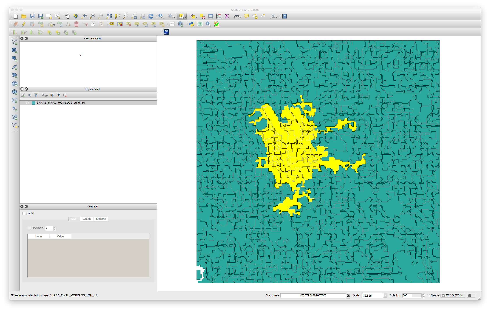
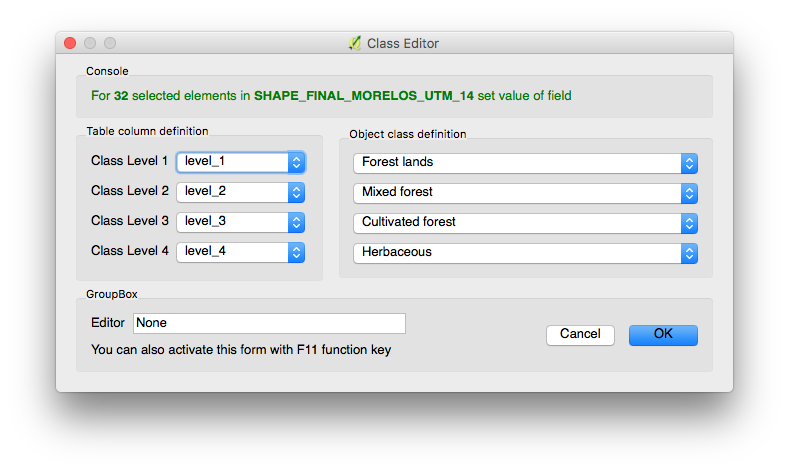

# Class Edito Plugin

The class editor plugin is a QGIS plugin that allows to relabel geometries in a shape file. Classes loaded into the plugin are specific to the Mexican landcover classification scheme established by INEGI.

## Instalation

In order to use the plugin, this repository must be cloned or downloaded into a local folder. Then the class-editor folder should be linked or copied into the QGIS plugin directory. This is:

```
~/.qgis2/python/plugins
```

Then, after restarting QGIS the plugin should be available from the plugins menu.

## Details

By selecting a group of features, the user is able to change the class assigned in each of four levels of aggregation.






